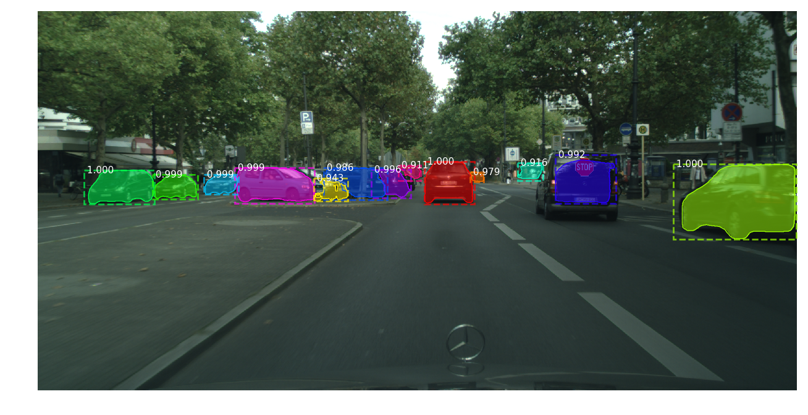

AI×Sec(Embed backdoor)
-----------------------

有一篇paper: https://arxiv.org/abs/1708.06733.pdf

Introduction
=============

介绍deep neural network，现在很popular但是需要的计算资源很高，因此就有了外包（介绍了一些外包的example），或者是transfer learning。然后提出了这两种情况都有新的security concerns（backdoored neural network），一个攻击场景就是training外包给了attacker，他们会给用户有backdoor的模型。模型在大部分情况下变现良好，只对特定的input出现错误的分类或者降低准确度，称作backdoor trigger。

|concept|

介绍了一个网络。上图左边是一个clean network，能正确分类input。中间是attacker用单独的网络来识别backdoor trigger，左右两边的网络都能检查input然后输出预期的分类并检查有没有backdoor，最后合并的时候检查两个网络的输出，如果有backdoor就选择attacker想要的输出，但是这种方法不能改变网络的结构。然后右边就是将后门识别嵌入到指定的体系结构中，就是现实情况，通过training set、backdoor trigger还有model计算权重，完成这个合起来的恶意训练过程。（这个是我的理解不知道对不对）

后文还有专门的研究手写数字识别、traffic sign detection在这种attack上面的脆弱性。

Structure
=============

1 Basics
 a DNN的基本数学原理以及training，简单陈述了transfer learning

 b 对于attack的建模Threat Model，分别build了outsource和transfer learning两种情况下的model，其中分别讲了两种model下的攻击目标

 c 相关的related work

2 Case 1 手写数字识别
 a baseline网络——攻击目标——攻击策略

 b result：分别给出了单个目标的攻击、All-to-All攻击（这个我并没有很理解），最后是analysis

3 Case 2 交通标志检测
 a setup：baseline是Faster-RCNN

 b Outsourced Training：目标、策略和结果

 c Transfer Learning：setup攻击、以及result

4 大概是分析了模型供应链中的一些漏洞，然后给出了安全建议

最后就是conclusion了

Some other papers
==================

**PoTrojan: powerful neural-level trojan designs in deep learning models**
(https://arxiv.org/pdf/1802.03043.pdf)

据说是第一次提出了在pre-trained NN model 当中插入神经级的木马，道理跟那个badnets一毛一样

contribution就是：
 1 第一次在文献中提出这个概念...

 2 用了俩例子show了插入木马的容易程度

 3 给出了一个设计触发器的通用算法，创建一个罕见的激活条件和对手是否有访问目标或预测或标签的培训实例的有效载荷

另外他们说badnets是假设对手可以访问学习模型，还要重新训练模型，他们说他们的方法不用。

**Threat of Adversarial Attacks on Deep Learning in Computer Vision: A Survey**
(https://arxiv.org/pdf/1801.00553.pdf)

澳洲佬的文章，可能是排版问题，感觉好难看啊，竟然是一篇survey：以cv的角度描述了敌对攻击（好像是图像分类的）；审查设计敌对攻击的工作，分析这些攻击的存在并提出针对它们的防御措施。为了强调在实际情况下敌对攻击是可能的，分别评估在现实世界情景中敌对攻击的贡献。

**Targeted Backdoor Attacks on Deep Learning Systems Using Data Poisoning**
(https://arxiv.org/pdf/1712.05526.pdf)

也是backdoor attack，不过是通过data poisoning，还有是非常弱的威胁模型下应用：1：对手不知道受害者系统使用的模型和训练集; 2：攻击者仅允许注入少量中毒样本; 3：后门钥匙很难被注意到即使是有意隐蔽。他们说是第一个表明数据中毒攻击可以在不触及培训过程的情况下创建可物理实施的后门。

contribution：
 1 他们说他们是第一个证明，在一个现实的威胁模型，假设对手不知道模型和训练集，而只有少量的中毒样本可以注入到训练数据中的后门中毒攻击是可行的

 2 提出了两类后门中毒攻击：输入实例密钥攻击和模式密钥攻击，它们都能达到攻击目标。特别是，输入实例密钥攻击会创建一组类似于单个输入实例的后门实例; 另一方面，模式密钥攻击创建了一组共享相同模式的后门实例（这个...感觉很像很像badnets的single和all-to-all attack）

 3 在俩人脸识别数据集上跑实验给了结果，前一种攻击只要5个毒，后一种攻击只要50个毒就可以reach 90% 的成功率

他们说他们的工作是首次证明黑匣子后门中毒攻击的可行性，同时仅注入少量中毒样本。此外，后门实例可以与物理密钥相关联，以使后门物理可实现。最后还强调了加强深度学习系统以抵御此类攻击的重要性。

Conclusion: 感觉现阶段相关研究还是处于占坑状态！！！

Ours
=============

无人车有一个障碍物识别系统，也是DCNN-based的，可以说是无人车的命了，如果这个系统出了什么差错，分分钟就是交通事故了。所以我们可以看一下对这个系统attack有没有可能。我们用嵌入后门的方式模拟攻击，用data poisoning 构造backdoor trigger来触发有后门的网络出错。

contribution:
 1 the first to propose 对于无人车识别系统的攻击

 2 做了一个全新的poisoning dataset

attack应该是这样的:

+--------------+-----------+-----------+
| network&data |  normal   |  backdoor |
+==============+===========+===========+
|    normal    |  correct  |  correct  |
+--------------+-----------+-----------+
|   backdoor   |  correct  |   wrong   |
+--------------+-----------+-----------+

attack goal:
 1 对于没有后门的图片，用正常的网络和有毒的网络都能正确识别分类

 2 对于有后门的图片，在正常网络下能正确识别分类，在有后门的网络里后门会被触发，使得识别到的后门实例的bounding box的范围有变化

 3 同时网络中的后门极难察觉

Experiment
============

这里应该会是一个漫长的过程......

Baseline用Mask R-CNN，搭环境什么的采坑记录可以参考这个 (https://blog.csdn.net/u011974639/article/details/78483779?locationNum=9&fps=1)

Mask R-CNN的开源代码: https://github.com/matterport/Mask_RCNN

Dataset: Cityscapes(https://www.cityscapes-dataset.com/)
 - 原图：leftImg8bit_trainvaltest
 - Annotation：gtFine_trinvaltest

preparation
>>>>>>>>>>>>
开源的代码是Mask R-CNN train on COCO dataset的，关于Cityscapes dataset，全网搜也只找到用caffe和MXnet框架的，没有用TensorFlow的，那就自己动手了！

开源代码里面有 **Training on Your Own Dataset**, step by step follow 其中的 **train_shapes.ipynb**, 主要是要重写
::

  load_shape()
  load_image()
  load_mask()

首先是，数据集gtFine中给出了很多很多的文件，但我只需要其中的json文件，于是写了个py批量处理，只保留了json文件 (此问题get).

其次，文件名好长好复杂，不利于写主函数的代码，为了简化自己的工作，比如说:
::

  aachen_000000_000019_leftImg8bit.png --> aachen_000000_000019.png

写了一个脚本批量处理 (finished!)

卡在了不知道如何将mask以及class_id和对应的图片中的实例对应起来，用程序读了gtFine中给出的labelTrainIds.png，结果显示是二维的，无法给每一个单独的实例一个对应的mask。search了很久发现了Cityscapes官网有给出一个处理它们数据集的脚本 (https://github.com/mcordts/cityscapesScripts), 但从 **createTrainIdLabelImgs.py** 发现好像没法获得对应的class id, 但看完代码觉得 **json2labelImg.py** 是可以的。Two days later，终于画出了所有的mask，得到了对应的class id (这个还是挺巧妙地隐藏在mask的文件名中的)。

开始load mask啦！主函数写完之后试着visualize几个samples出来看，发现大部分图片的mask只能load到一张，找了很久发现原因是有些gt mask的文件夹是空的，应该是因为图片中没有任何一类我想要train的class，所以是没有画mask的。于是又写了一个脚本把空文件夹以及对应的图片去掉，最终training有2932张，val有489张。(load mask也成功啦！)

training
>>>>>>>>>
- 保留了源码中的设置，但在第200个step之前总是会broken了。检查过数据集没有问题，在GitHub上发现了有可能是代码更新之后的问题，于是将代码update之后，这个问题竟然就解决了！train完的结果，精度惨不忍睹，该detect的没detect，不该detect的还框出来了，很明显的欠拟合。

- 开始调各种不同的参数，画个table来记录一下:

+----------+--------+-----------+-----------------------+--------------+---------+---------+---------+-------+
|   TIME   | STEPS  | VAL_STEPS |  RPN_ANCHOR_SCALES    | IMAGE_RESIZE | MIN_DIM | MAX_DIM |mAP_train|mAP_val|
+==========+========+===========+=======================+==============+=========+=========+=========+=======+
| 04221548 | 1000*2 |    50     | (8, 16, 32, 64, 128)  |     crop     |   960   |   1024  |         |       |
+----------+--------+-----------+-----------------------+--------------+---------+---------+---------+-------+
| 04221757 | 1000*2 |    50     |(16, 32, 64, 128, 256) |    square    |   800   |   1024  |         |       |
+----------+--------+-----------+-----------------------+--------------+---------+---------+---------+-------+
| 04222318 | 5000*2 |    250    |(32, 64, 128, 256, 512)|    square    |   800   |   1024  |  0.345  | 0.089 |
+----------+--------+-----------+-----------------------+--------------+---------+---------+---------+-------+
| 04241424 |                                  COCO config                                  |  0.277  |  0.05 |
+----------+--------+-----------+-----------------------+--------------+---------+---------+---------+-------+
| 04260154 | 6000*4 |    300    |             COCO config                                  |   1.0   |  0.15 |
+----------+--------+-----------+-----------------------+--------------+---------+---------+---------+-------+
| 04270621 | 6000*4 |    300    |             COCO config                                  |   0.8   |  0.45 |
+----------+--------+-----------+-----------------------+--------------+---------+---------+---------+-------+
| 04282338 | 6000*4 |    300    |             COCO config                                  |   1.0   |  0.48 |
+----------+--------+-----------+-----------------------+--------------+---------+---------+---------+-------+

- 04222318: 为了验证是不是自己把模型调坏了，直接用了COCO pre-trained的weights来detect，准确率挺高的，那真的是自己调坏了。
- 04241424: 非常不幸的是，用了训练coco数据集一模一样的参数，结果还是非常差。那就是有别的问题了，找了很久，发现很可能是因为迭代次数太少了，导致一直欠拟合。
- 04260154: 训练参数里面还调整过learning rate (0.01, 0.001)，这次training很明显整个准确率都上来了，不过从mAP看到有点overfit了，原因应该是因为之前在数据集预处理的时候，我另外随机抽取了800张图片出来弄成了一个新的数据集打算后期做后门用的，从结果看这个样本量太小了，要换回原本2000多张。
- 04270621: 终于train好了！在test set里面随机选了一张：

|result|

- 04282338: 有后门的网络也构造好了，在测试集上看过，泛化能力挺强的

data poisoning
>>>>>>>>>>>>>>>>
800多张图片的数据集会overfit，于是还是得做2000多张的backdoor images. Trigger选了 *BelgiumTS Dataset* 里面的一个 *stop* 标志:

|stop|

对这个backdoor用程序调了亮度，抠了图，腐蚀膨胀成一个可以贴到别的图片上的backdoor. 然后自己想了个办法，找出每张图片里面最大的object，写了个脚本让backdoor往2000多张图片上面贴了这个后门(finished!happy!)

现在就可以构造这个有后门的网络了！(调参写在上面了)

Result:

|bd_bd|

Experiment KO!
